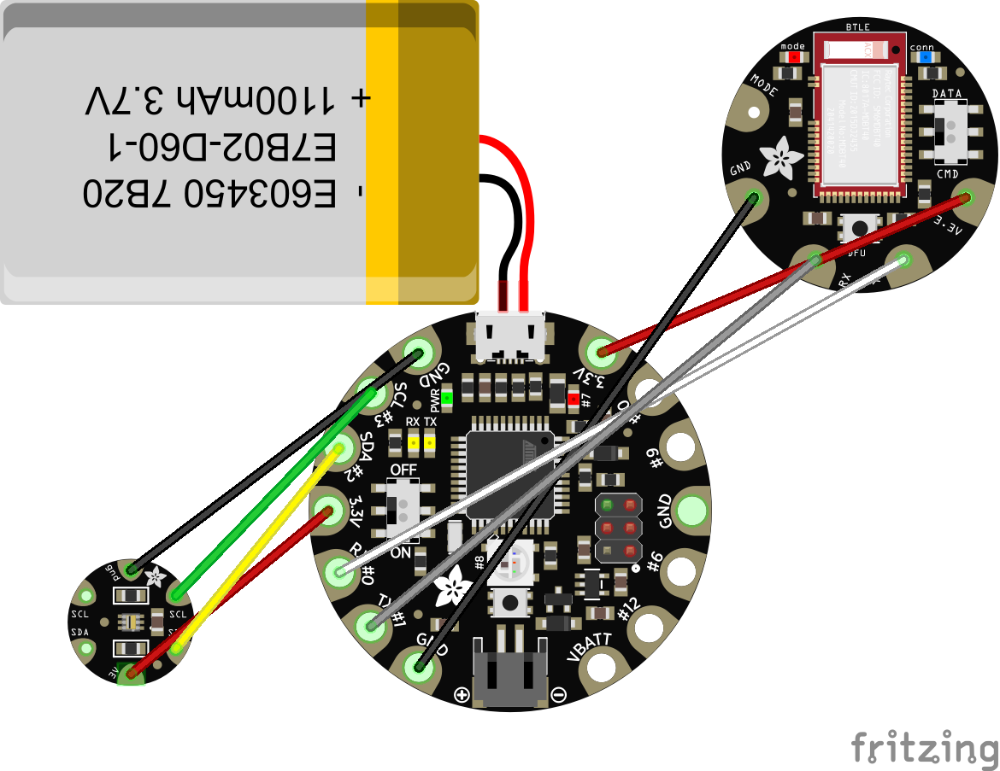

# Lux Thing

**Lux Thing** is a system composed of a wearable objet and a mobile app.

## Hardware

A very simple assemblage of Adafruit board, module and sensor:

* Adafruit Flora [Buy it there](http://amzn.to/2FjBvLO)
* Adafruit Flora Lux sensor TSL2561 [Buy it there]( http://amzn.to/2tmVROw)
* Adafruit Flora Bluefruit LE Module [Buy it there](http://amzn.to/2FuwmzS)

## Software

### Micro code

The micro code for the object is contained in the `device/` folder.

### Mobile app code

